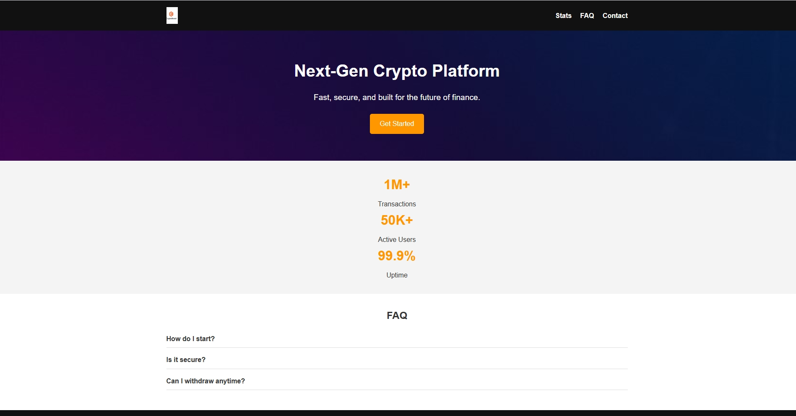

# 🚀 Crypto Landing Page Demo

Adaptive, responsive landing page for a fictional crypto platform.  
Built with **HTML5**, **CSS3**, and **JavaScript** — focused on clean UI, smooth animations, and conversion‑oriented UX.

 <!-- сюда вставь скриншот лендинга -->

---

## 🌐 Demo
[**View Live Project**](https://dexhtml.github.io/crypto-landing-demo/)

---

## ✨ Features
- 📱 **Responsive design** — looks great on desktop and mobile
- 📊 **Animated statistics section** — highlights key metrics
- ❓ **FAQ accordion** — interactive Q&A with smooth animations
- 🎨 **Hero section with background image** — strong first impression
- ⚡ **Lightweight & fast** — optimized for quick load times

---

## 🛠 Tech Stack
- **HTML5** — semantic, accessible markup
- **CSS3** — modern layout, flexbox, responsive media queries
- **JavaScript (Vanilla)** — interactivity and animations
- **GitHub Pages** — free hosting & deployment

---

## 📂 Project Structure
```plaintext
crypto-landing-demo/
├── index.html
├── css/
│   └── style.css
├── js/
│   └── script.js
└── images/
    ├── logo.png
    ├── bg.jpg
    └── screenshot.jpg
```

## 👨‍💻 Author
**Vyacheslav (DexHTML)** — Frontend Developer specializing in crypto landing pages, UX animations, and conversion optimization.  
📧 Contact: [Telegram](https://t.me/Slaffkamak) | [Email](mailto:immun1986@gmail.com)

---
